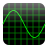

#  Oscilloscope  

Android Oscilloscope. The app is available on
[F-Droid](https://f-droid.org/packages/org.billthefarmer.scope)
and [here](https://github.com/billthefarmer/scope/releases). See the
[Wiki](https://github.com/billthefarmer/scope/wiki) for more screenshots
and documentation.

 *  Timebase 0.1 ms - 0.5 sec
 *  Sync control
 *  Single shot
 *  Storage
 *  Index
 *  Spectrum

### Using
 The icons on the toolbar are, from left to right:
 
 *  **Bright line** - Defeats the sync and single shot
 *  **Single shot** - Touch the trigger icon to get a trace
 *  **Trigger** - Touch for a trace
 *  **Timebase** - Drops a submenu of timebase timings
 *  **Storage** - Does not clear the display between traces
 *  **Clear** - Clears the display
 *  **Left** - Moves the trace to the left
 *  **Right** - Moves the trace to the right
 *  **Start** - Moves the trace to the start
 *  **End** - Moves the trace to the end
 *  **Spectrum** - Spectrum display
 *  **Settings** - Settings display

The last two or six items may be on the menu, depending on the size of
the device.

### Oscilloscope
Touching the display will produce a vertical index line, which will
show the value at that point. The value is arbitrary, as there is
automatic gain control on the input so the trace does not get
clipped. The display will respond to scroll and scale gestures. The
index can be removed and scaling reset by touching the Start icon.

Touch the left edge Y scale to adjust the sync level. A pointer will
appear which can be adjusted by sliding up and down. Touch the start
icon to reset the level to zero.

In single shot mode the timebase may be changed to zoom in and pan
left and right using the right and left icons.

### Spectrum
The spectrum display shows a spectrum with a logarithmic frequency
scale. An index line shows the dominant frequency in the input. The
frequency and input level is also displayed in the toolbar. To lock
the display, touch spectrum display or the lock icon in the
toolbar. Touch it again to release the lock. To display the help
screen, touch the help icon.

### Settings
The input source may be selected. Some of the selections will not be
available, depending on the device. The fill option selects spectrum
trace fill. The hold option selects spectrum trace hold. The screen
option will stop the screen turning off. The theme option selects the
app theme. The about item shows the version and copyright.
